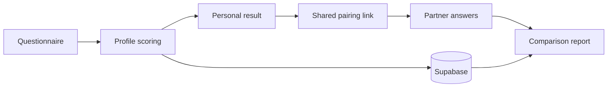

[English](README.md) | [中文](README.zh.md)

# Couple-test · LY Analytics

**Turn a questionnaire into a personal result you can explore and share with someone else.**

A Next.js web app with a 26-question relationship quiz, animal-themed result profiles and a shared partner-comparison flow. The broader site also includes short cat, dog, food and pig personality quizzes.

[Try the website](https://couple-test.pages.dev/) · [Start the relationship quiz](https://couple-test.pages.dev/love) · [Developer](https://github.com/yil337)

## From individual answers to a shared result

The relationship flow combines several questionnaire dimensions into a personal profile. A participant can share a pairing link; after a second person completes the quiz, both profiles feed into a comparison report.

- **Profiles with a visible scoring model.** Question mappings, dimension scores and result classifications are implemented in TypeScript rather than hidden behind a remote model call.
- **Two-person sharing.** Supabase stores the paired results used by the invitation and comparison pages.
- **Results designed to be revisited.** Animal profiles, explanatory reports and shareable result views turn completion into a browsing experience.
- **A reusable quiz catalog.** Test definitions and question sets support multiple quiz themes within the same site.

This is an entertainment and self-reflection project. Its scores are custom application logic, not a clinically validated assessment or a prediction of relationship success.

## Implementation

**Next.js 15 · React · TypeScript/JavaScript · Tailwind CSS · Supabase**



Start with `pages/love-test/index.tsx` for the main quiz flow, `src/lib/scoring/` for the scoring rules, and `pages/result.tsx` and `pages/match/[id].tsx` for the result views. The current site uses Supabase; older Firestore setup notes remain in the repository as migration history.

## Run locally

Use Node.js 20+ and your own Supabase project. Copy `env.example` to `.env.local`, then set `NEXT_PUBLIC_SUPABASE_URL` and `NEXT_PUBLIC_SUPABASE_ANON_KEY`. Configure the database using [the Supabase setup notes](SUPABASE_SETUP.md); saving and sharing results require it.

```bash
git clone https://github.com/yil337/Couple-test.git
cd Couple-test
npm ci
npm run dev
```

Open **http://localhost:3000**. To create a production build, run `npm run build`. Cloudflare-specific notes are in [CLOUDFLARE_BUILD.md](CLOUDFLARE_BUILD.md).

The app interface and quiz content are primarily in Chinese.
