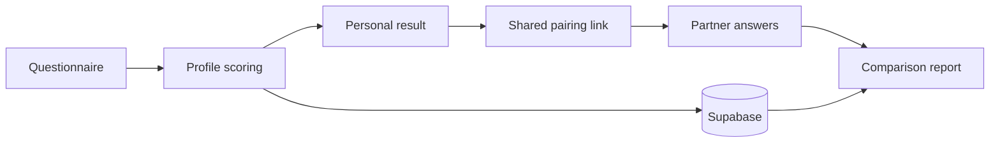

[English](README.md) | [中文](README.zh.md)
<!-- Synced with README.md as of 2026-10-02 -->

# Couple-test · LY Analytics

**答完问卷，得到一份可以细看、也能邀请另一个人一起探索的结果。**

这是一个 Next.js 测评网站，主流程包含 26 道关系问卷、动物主题个人画像，以及通过链接邀请对方完成的双人对照报告。站内还收录了猫、狗、食物和小猪等短测验。

[体验网站](https://couple-test.pages.dev/) · [进入关系测验](https://couple-test.pages.dev/love) · [开发者](https://github.com/yil337)

## 从个人答案到双人报告

关系测验先把多个问卷维度组合成个人画像。参与者可以分享配对链接，等第二个人完成后，网站再生成双方的对照结果。

- **能读懂的计分实现**：题目映射、维度分数和类型判定写在 TypeScript 中，结果不依赖远程大模型临时生成。
- **双人分享流程**：通过 Supabase 保存配对结果，连接邀请、答题和报告页面。
- **可以继续浏览的结果页**：用动物画像、解释报告和分享视图，让答完之后还有内容可看。
- **可扩展的测验目录**：独立的测验定义和题库，支持同一站点中的多个主题。

项目用于娱乐与自我探索。分数来自自定义应用规则，不是经过临床验证的心理评估，也不能预测一段关系是否成功。

## 技术实现

**Next.js 15 · React · TypeScript/JavaScript · Tailwind CSS · Supabase**



主答题流程在 `pages/love-test/index.tsx`，计分规则在 `src/lib/scoring/`，结果视图在 `pages/result.tsx` 和 `pages/match/[id].tsx`。当前网站使用 Supabase，仓库中早期的 Firestore 配置文档保留为迁移记录。

## 本地运行

使用 Node.js 20+，准备自己的 Supabase 项目。将 `env.example` 复制为 `.env.local`，填写 `NEXT_PUBLIC_SUPABASE_URL` 和 `NEXT_PUBLIC_SUPABASE_ANON_KEY`，再参考 [Supabase 配置说明](SUPABASE_SETUP.md)配置数据库。保存与分享结果需要数据库支持。

```bash
git clone https://github.com/yil337/Couple-test.git
cd Couple-test
npm ci
npm run dev
```

打开 **http://localhost:3000**。生产构建使用 `npm run build`，Cloudflare 相关说明见 [CLOUDFLARE_BUILD.md](CLOUDFLARE_BUILD.md)。

应用界面与题目内容以中文为主。
